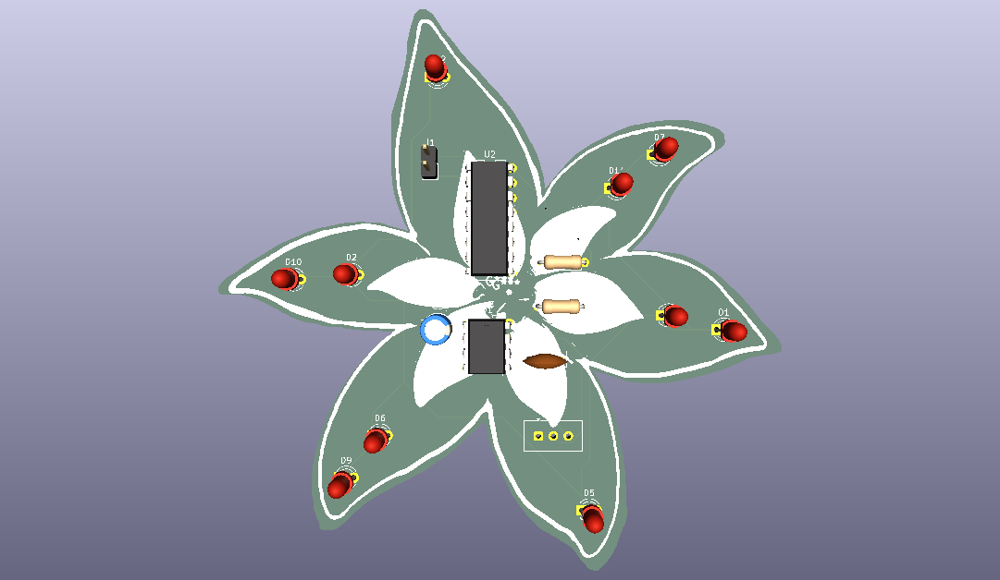

# Lily-Blinky-Board
My first hardware! A blinky board in the custom shape of a lily  🪷

This project features 10 LED lights that blink in sequence, and was made in KICAD from a Hack Club Stasis tutorial.
  It also uses a NE555P timer, a 4017, a Conn_01x02Socket and multiple capacitators/resistors.

<h3>Sleepover Note</h3>I forgot to set up hackatime for kicad and so haven't logged any time, but it took me about 4h 40min to make :)
