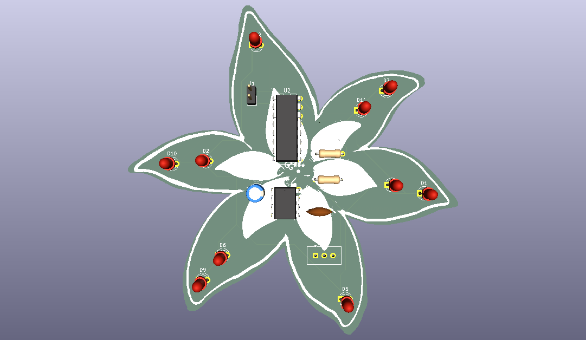

# Lily-Blinky-Board
My first hardware! A blinky board in the custom shape of a lily (my favourite flower!)  🪷
 
I wanted to get into hardware, and this was kind of the perfect first project as it was easy to follow but introduced my to quite a few different skills- creating PCBs, soldering. 

This project features 10 LED lights that blink in sequence, and was made in KICAD from a Hack Club Stasis tutorial.
  It also uses a NE555P timer, a 4017, a Conn_01x02Socket and multiple capacitators/resistors (I believe there is a kit for these?). 
 As my first hardware project, it was pretty difficult, especially with the DXF files, but I am really proud of the final result, and it was pretty fun to make, so I will almost certainly be building more hardware in the future.

<h3>Build Journey!</h3>

 
I built the board in KICAD, and created a custom border and silkscreen to make it look more like a lily. As I mentioned in my stasis journal this took a long time to sort through the DXF file, but the wiring diagrams and schematics weren't too hard to figure out
  

 
Soldering took two attempts, as it was my first time, and the first one ended up pretty messy and didn't work. However, the second time I figured out what went wrong beforehand and was able to solder it a whole lot better than the first attempt.  It was very exciting connecting the battery and seeing the board light up!
This project is pretty much just the board + soldered components, no case or anything made here :)

<h3>BOM</h3>
Custom PCB -  -  -  - From JLCPCB -  -  -  - $2.30USD
 
Blinky Board Kit -  -  -  - Hackclub HQ? -  -  -  - [no price]

